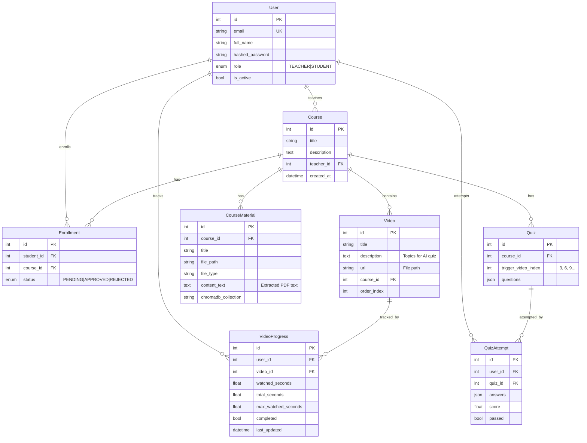

# CourseTwin - Complete Project Specification

## Overview

**CourseTwin** is an AI-powered Learning Management System (LMS) for video-based courses with:
- Teacher & Student roles
- Video upload with progress tracking
- AI-generated quizzes based on video topics
- AI Tutor chatbot for Q&A

---

## Tech Stack

| Layer | Technology |
|-------|------------|
| Frontend | Next.js 14, React, TypeScript, Tailwind CSS |
| Backend | FastAPI (Python 3.11+), Async SQLAlchemy |
| Database | SQLite (dev) / PostgreSQL (prod-ready) |
| AI | Groq API (primary), Ollama (fallback) |
| RAG | ChromaDB for document embeddings |

---

## Project Structure

```
course-twin/
├── backend/
│   ├── app/
│   │   ├── api/api_v1/endpoints/  # API routes
│   │   ├── core/                   # Config, security, AI clients
│   │   ├── models/                 # SQLAlchemy models
│   │   ├── schemas/                # Pydantic schemas
│   │   └── db/                     # Database session
│   ├── uploads/                    # Uploaded files
│   └── requirements.txt
├── frontend/
│   ├── src/app/                    # Next.js pages
│   ├── src/components/             # React components
│   └── src/lib/                    # API client
└── .env                            # Environment variables
```

---

## Database Schema



---

## API Endpoints

### Authentication
| Method | Endpoint | Description |
|--------|----------|-------------|
| POST | `/api/v1/auth/login` | Login, returns JWT token |
| POST | `/api/v1/auth/register` | Register new user |

### Courses
| Method | Endpoint | Description |
|--------|----------|-------------|
| GET | `/api/v1/courses/` | List all courses |
| POST | `/api/v1/courses/` | Create course (teacher) |
| GET | `/api/v1/courses/{id}` | Get course details |
| DELETE | `/api/v1/courses/{id}` | Delete course (cascade) |
| POST | `/api/v1/courses/{id}/videos?title=X&description=Y&order_index=N` | Upload video |
| DELETE | `/api/v1/courses/{id}/videos/{video_id}` | Delete video |
| GET | `/api/v1/courses/{id}/materials` | List materials |
| POST | `/api/v1/courses/{id}/materials` | Upload PDF/TXT |
| DELETE | `/api/v1/courses/{id}/materials/{material_id}` | Delete material |

### Videos
| Method | Endpoint | Description |
|--------|----------|-------------|
| GET | `/api/v1/videos/{id}/stream` | Stream video |
| GET | `/api/v1/videos/{id}/progress` | Get user progress |
| POST | `/api/v1/videos/{id}/progress` | Update progress |
| GET | `/api/v1/videos/course/{course_id}/progress` | Get all course progress |

### Quiz
| Method | Endpoint | Description |
|--------|----------|-------------|
| GET | `/api/v1/quiz/course/{id}/check` | Check if quiz needed |
| POST | `/api/v1/quiz/course/{id}/generate?trigger_video_index=3` | Generate quiz |
| POST | `/api/v1/quiz/submit` | Submit quiz answers |
| GET | `/api/v1/quiz/course/{id}/status` | Get quiz pass status |

### Users & Enrollment
| Method | Endpoint | Description |
|--------|----------|-------------|
| POST | `/api/v1/users/enroll/{course_id}` | Request enrollment |
| PUT | `/api/v1/users/enroll/{enrollment_id}` | Approve/reject |
| GET | `/api/v1/users/enrollments/pending` | Teacher: pending requests |

### Chat (AI Tutor)
| Method | Endpoint | Description |
|--------|----------|-------------|
| POST | `/api/v1/chat/{course_id}` | Send message, get AI response |

---

## Key Data Flows

### Quiz Generation Flow
```
1. Student completes videos 1, 2, 3
2. Frontend calls: GET /quiz/course/{id}/check
3. If quiz_needed=true, calls: POST /quiz/course/{id}/generate?trigger_video_index=3
4. Backend fetches:
   - Video descriptions for videos 1, 2, 3
   - PDF content from CourseMaterial
5. Backend calls Groq API with strict prompt
6. Returns 10 questions based ONLY on video topics
7. Student submits via: POST /quiz/submit
8. If score >= 70%, quiz.passed = true
9. Videos 4, 5, 6 unlock
```

### Video Progress Flow
```
1. Student plays video
2. Every 5 seconds: POST /videos/{id}/progress
3. Backend updates max_watched_seconds
4. If max_watched_seconds >= 90% of total → completed = true
5. Frontend shows green checkmark
```

---

## Environment Variables

```env
# backend/.env
SECRET_KEY=your-secret-key
GROQ_API_KEY=gsk_xxxxx
```

---

## Collaboration Recommendations

### Option 1: GitHub Collaboration (Recommended)
**Best for:** Tight integration, shared codebase

```
1. Create GitHub repo
2. Each teammate creates feature branch
3. Use Pull Requests for code review
4. Merge into main when ready
```

**Pros:** Single codebase, easy deployment, version control
**Cons:** Need to understand full project structure

### Option 2: Microservice API Integration
**Best for:** Independent features, different tech stacks

```
1. Teammate builds their feature as separate API
2. You add their API endpoint to your .env
3. Your backend calls their API when needed
```

**Example:** If teammate builds "Video Transcription Service":
```python
# In your backend, add:
TRANSCRIPTION_API_URL=http://teammates-server:5000/transcribe

# Call it when uploading video:
response = await httpx.post(TRANSCRIPTION_API_URL, files={"video": file})
transcript = response.json()["transcript"]
```

**Pros:** Independence, can use different languages
**Cons:** More complex deployment, need to sync data formats

---

## Adding New Features (Guide for Teammates)

### Step 1: Understand the Models
Read `backend/app/models/` to understand data structure.

### Step 2: Add New Model (if needed)
```python
# backend/app/models/new_feature.py
from sqlalchemy import Column, Integer, String, ForeignKey
from app.db.session import Base

class NewFeature(Base):
    __tablename__ = "new_features"
    id = Column(Integer, primary_key=True)
    course_id = Column(Integer, ForeignKey("courses.id"))
    # ... your fields
```

### Step 3: Add Schema
```python
# backend/app/schemas/new_feature.py
from pydantic import BaseModel

class NewFeatureCreate(BaseModel):
    name: str

class NewFeature(NewFeatureCreate):
    id: int
    class Config:
        from_attributes = True
```

### Step 4: Add Endpoint
```python
# backend/app/api/api_v1/endpoints/new_feature.py
from fastapi import APIRouter, Depends
router = APIRouter()

@router.post("/")
async def create_feature(...):
    # your logic
```

### Step 5: Register Router
```python
# backend/app/api/api_v1/api.py
from app.api.api_v1.endpoints import new_feature
api_router.include_router(new_feature.router, prefix="/new-feature", tags=["new-feature"])
```

### Step 6: Add Frontend Page
```typescript
// frontend/src/app/feature/page.tsx
"use client";
import api from '@/lib/api';
// your component
```

---

## Running the Project

```bash
# Backend
cd backend
python -m venv .venv
.venv\Scripts\activate
pip install -r requirements.txt
python reset_database.py  # Fresh start
uvicorn app.main:app --reload --port 8001

# Frontend
cd frontend
npm install
npm run dev
```

**Default Accounts:**
- Teacher: `teacher@example.com` / `teacher123`
- Student: `student@example.com` / `student123`

---

## Feature Ideas for Teammates

| Feature | Complexity | Data Needed |
|---------|------------|-------------|
| Video Transcription | Medium | Video files |
| Certificate Generation | Low | Quiz pass data |
| Analytics Dashboard | Medium | Progress data |
| Discussion Forums | High | Course/User data |
| Assignment Submission | Medium | Course/User data |
| Live Quiz (Multiplayer) | High | WebSocket integration |
